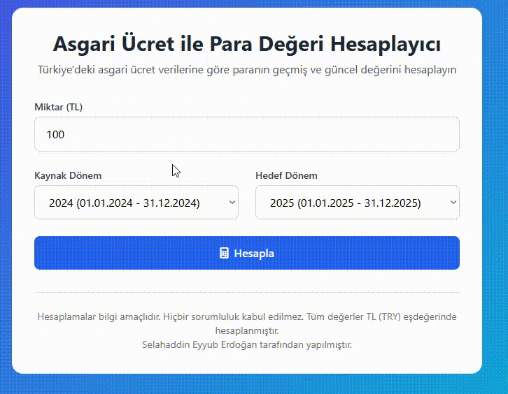

 
Türkiye'deki asgari ücret verilerine dayanarak paranın geçmişteki ve günümüzdeki değerini hesaplayan modern web uygulaması.

## ✨ Özellikler

- 🕰️ **1974'ten 2025'e kadar** tüm asgari ücret dönemleri
- 💰 **Gerçek zamanlı hesaplama** - Anında sonuç görüntüleme
- 📱 **Tamamen duyarlı tasarım** - Tüm cihazlarda mükemmel çalışır
- 🎨 **Modern arayüz** - Glass morphism ve gradient efektleri
- ⚡ **Hızlı ve hafif** - Tek HTML dosyası, kurulum gerekmez

## 🚀 Kullanım

1. **Miktarı girin** - TL cinsinden hesaplamak istediğiniz tutarı yazın
2. **Kaynak dönemi seçin** - Paranın hangi dönemdeki değerini hesaplamak istiyorsanız
3. **Hedef dönemi seçin** - Paranın hangi dönemdeki karşılığını öğrenmek istiyorsanız
4. **HESAPLA butonuna tıklayın** - Sonucu anında görün

## 🧮 Hesaplama Formülü

Sonuç = (Girilen Miktar / Kaynak Dönem Asgari Ücreti) × Hedef Dönem Asgari Ücreti

## 📊 Veri Kaynağı

Uygulama, Türkiye'de 16 yaşını dolduranlar için belirlenen brüt aylık asgari ücret verilerini kullanır. 2005 öncesi değerler 1.000.000'a bölünerek yeni TL eşdeğerine dönüştürülmüştür.

## 🛠️ Teknolojiler

- **HTML5** - Yapısal temel
- **Tailwind CSS** - Modern styling
- **Vanilla JavaScript** - İşlevsellik
- **Font Awesome** - İkonlar

## 📁 Kurulum

1. Bu dosyayı bilgisayarınıza indirin
2. `.html` uzantılı dosyayı herhangi bir tarayıcıda açın
3. Hesaplamaya başlayın!

## ⚠️ Önemli Not

Bu hesaplamalar **bilgi amaçlıdır** ve kesin finansal kararlar için kullanılmamalıdır. Tüm değerler TL (TRY) eşdeğerinde hesaplanmıştır.

